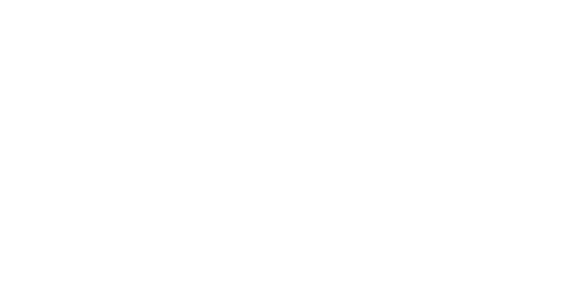
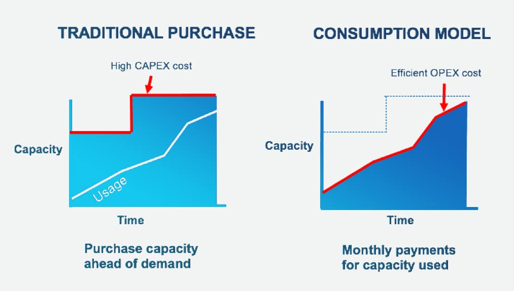

### **A brief introduction into Cloud Computing**

Cloud computing refers to the delivery of computing services over the internet. These services are provided by cloud service providers, such as Amazon Web Services (AWS), Microsoft Azure, and Google Cloud Platform, who maintain the necessary hardware and software infrastructure to support them. 

Users can access these services remotely with an internet connection and only pay for what they use. This provides businesses and individuals with greater flexibility, scalability, and cost-effectiveness compared to traditional on-premises computing.

Cloud computing has its roots in the 1960s, but it didn't become widely popular until Amazon Web Services launched its Elastic Compute Cloud service in the early 2000s. This led to the emergence of public cloud computing, where third-party providers offer computing resources and services over the internet. Microsoft (Microsoft Azure), Google (Google Cloud Platform), and IBM later joined the market, and today, cloud computing is used by organizations of all sizes.

### **The benefits of cloud computing for a business**

Cloud computing provides a range of advantages, such as quick scalability, easy access from anywhere, cost savings through pay-as-you-go pricing, high reliability, strong security, and improved collaboration.

It streamlines IT processes, provides real-time access to shared data and applications, and offers better security than what many businesses can achieve on their own. As a result, businesses can maintain their agility and competitiveness in a constantly changing business environment.

### **A brief introduction into AWS and its history**

Amazon Web Services (AWS) is a cloud computing platform provided by Amazon that includes services related to networking, compute, storage, middleware, IoT and other processing capacity, as well as software tools.

AWS was originally created to tackle the requirements of Amazons own e-commerce business and with its initial rapid innovation and development, the business was made avaiable to other companies. Its first major service was the Simple Storage Service (S3) in 2007, which provided businesses with a scalable storage solution. The next major service came into effect a year later with Elastic Compute Cloud (EC2) that supplied scalable computing resources.

### **The As A Service business model**

"As A Service" refers to IT packages that are offered by cloud computing platforms. The three most common packages are software as a service (SaaS), platform as a service (PaaS) and infrastructure as a service (IaaS).

- **SaaS** is on-demand access to ready-to-use, cloud-hosted application software - typically aimed at general users.

- **PaaS** is on-demand access to a complete, ready-to-use, cloud-hosted platform for developing, running, maintaining and managing applications - typically aimed at software developers.

- **IaaS** is on-demand access to cloud-hosted physical and virtual servers, storage and networking - the backend IT infrastructure for running applications and workloads in the cloud - typically aimed at network architects.

### **The three cloud deployment models**

There are three cloud deployment models; public, private and hybrid clouds.

**Public cloud** is a public service intended to be used and accessed by the general public. This model commonly uses a pay-as-you-go format and allows businesses to easily scale depending on computing requirements. The service provider  is also responsible for updating its services and tools.

**Private cloud** is typically a companies internal server. It is separated from the public and can only be accessed within the organisation. This model is ideal for organisations requiring high compliance standards and security; for example, the healthcare industry. There are high costs associated to this model as the organisation is required to upgrade and maintain the systems themselves or through a vendor service.

**Hybrid cloud** is a mixture between the two; public and private clouds. This utilises the benefits from both the other types including being secure and scalable. Companies that utilise hybrid clouds include Netflix and Uber, as they require scalable computing resources to match bandwidth demands whilst still having the responsibility to protect its users information through a private cloud.

### **Operating expenditure (OpEx) and Capital expenditure (CapEx)?**

Operating expenditure (OpEx) are the continuous expenses a company incurs to sustain operational activities; this includes salaries, taxes, utilities and research and development.

Capital expenditure (CapEx) are funds used to acquire, upgrade and maintain physical assets. This expenditure aims to increase the companies operation scope whilst adding future economic benefit. These are can be major purchases to be fulfilled over the long term.

Cloud providers are largely transitioning from CapEx to OpEx. This enables businesses to reduce capital expenditure specifically to remove physical infrastructure. This shifts companies investments from one-off, potentially expensive expenditures to a scalable, flexible, pay-as-you-go service. 

>(forcam.com, 2022 )

### **Case studies on companies that have transferred to the Cloud and what that has allowed them to do?**

**GO-JEK** was founded in Jakarta, indonesia in 2010 and started as a call centre for transportation services, specifically on motorbikes. The company launched a mobile application in 2015 after conducting a study on customer behaviours to cater for the demands of transportation as well as food delivery. The success of the business is largely due to its technology team, who elected to transition its company to Google Cloud Platform in order to grow and expand into new markets. GO-JEK now operates in 167 cities and districts with 108 million application downloads. GO-JEK continues to work closely with the Google Cloud Professional Services to explore and refine its capabilites as it looks to exapnd further across south east asia.

**Netflix** began as a DVD rental business and has now transitioned into one of the largest streaming services in the world. Netflix initial transition to the cloud was prompted by its large user base, which required high flexibility and scability in terms of data storage capacity. Its transition to the cloud occured relatively early on in the technologies emergence as a suitable alternative to hosting on-premise systems. This has now allowed Netflix to provide its service to its 118 million global customers, who collectively consume 140 million hours of video per day.

