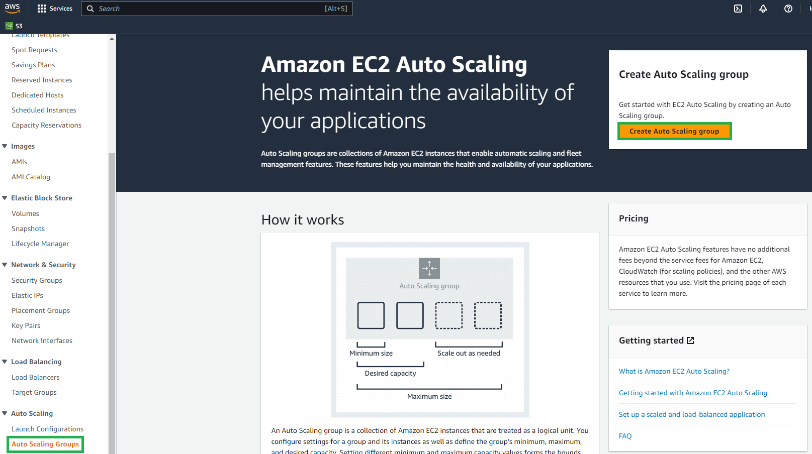
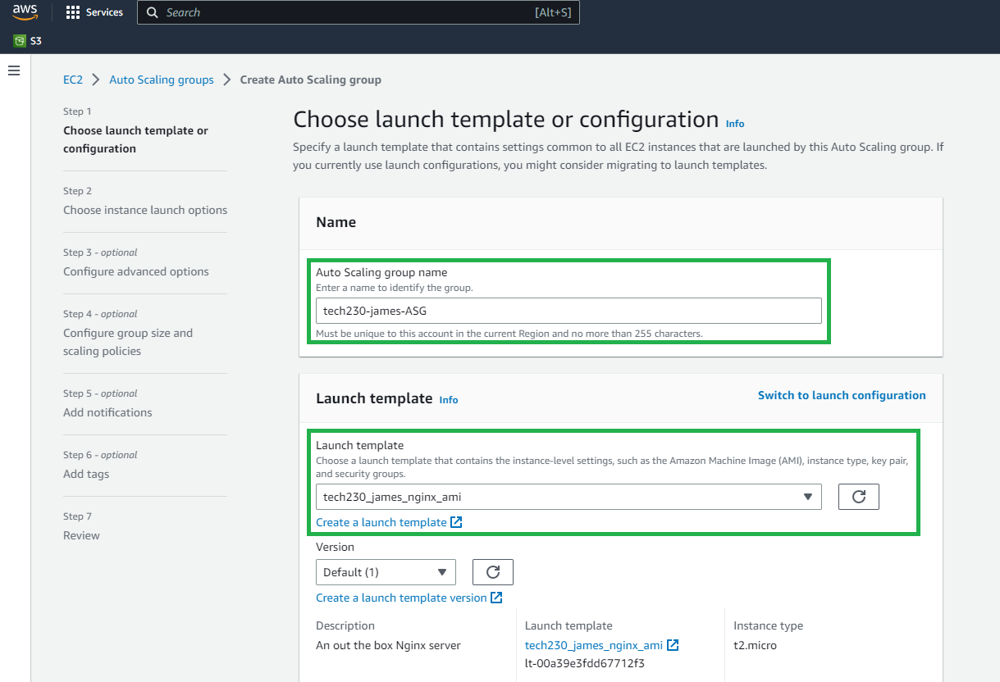
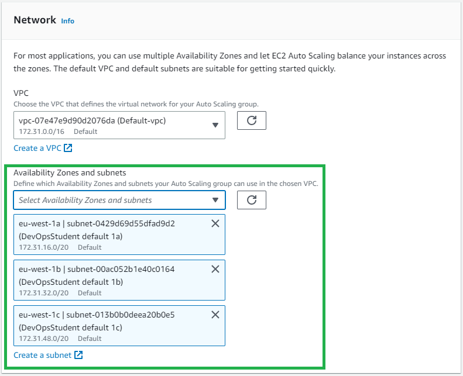
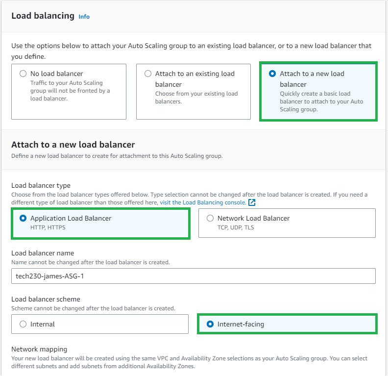
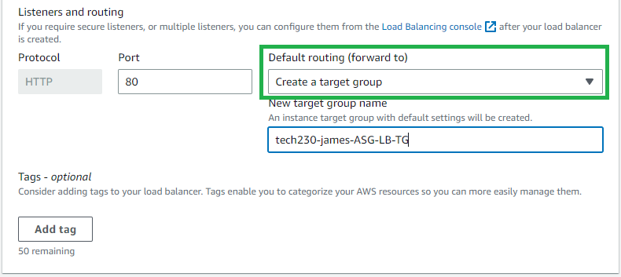
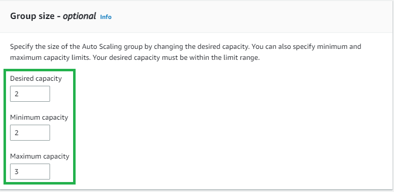
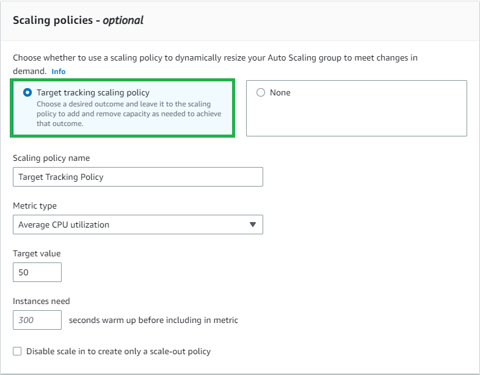
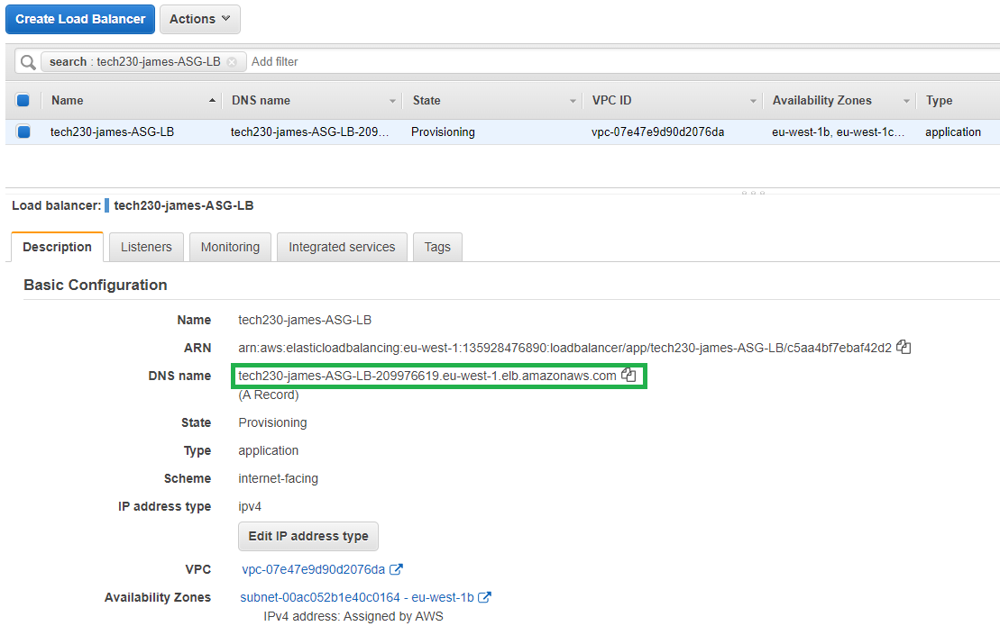
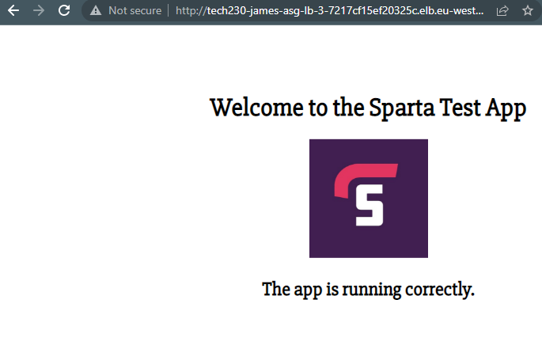

# Setting up Auto Scaling

Prior to the auto scaling setup, ensure a working instance of the AMI application is available and create a launch template from it.

 >Important note: the application state may not be run once the template is created; enter the provision script into the template user data.

A tutorial walk-through of this can be found in [Creating an AMI](https://github.com/PutuJem/tech230_AWS/blob/main/creating_an_ec2_instance.md).

1. Navigate to the "Auto Scaling Groups" and "Create an Auto Scaling Group".

1. Create a name and select an appropriate launch template.

3. Select the default VPC and availability zones for where the instances will be deployed; availability zones enable scalability and high availability, in the occurence of one zone being down the other zones can still be accessed.

4. Attach a new load balancer, as shown in the example below, and select "Application Load Balancer" with an appropriate name. Ensure to also amend the scheme to "Internet-facing", as the application is being accessed through the internet.

 > Note: Turn on the Elastic Load Balancing health checks, as recommended by AWS.

5. Under "Listeners and routing, create a new target group and name it appropriately.

6. Set a suitable group size.

7. Select the "Target tracking scaling policy" and set the rules to scale out as intended.

8. Create a tag to assist in identifying the auto scaling group; in example, set the key as "Name" and value as "tech230-james-ASG".

9. Review the configuration of the scaling group and when ready, create the auto scaling group.

10. To test the application is working as intended, navigate to the "Load balancer" tab within EC2 services and select the recently created auto scaling group.

11. Locate the DNS address and enter it into the web address, the application should be displayed as shown. 

