# AWS Cloud Watch

Amazon CloudWatch is a metrics repository, which enables its customers to retrieve statistics based on specified key metrics. The customer is able to fully customise these metrics to their specific business needs. The way in which AWS manages these metrics and notifies its customers is shown in the diagram below.

> In the example below, cloud watch is set up for an EC2 instance of Spartas application.

### **Setting up Cloud Watch**

Within a new or existing instance, navigate to the specific `Instance summary` and scroll to bottom of the page, where there are more details. Click on the `Monitoring` tab and `Manage detailed monitoring`.

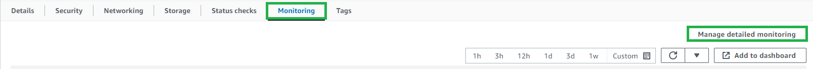

In `Detailed monitoring`, `Enable` the setting and `Confirm`. As shown in the screenshot below, this enables monitoring graphs with a 1-minute period.

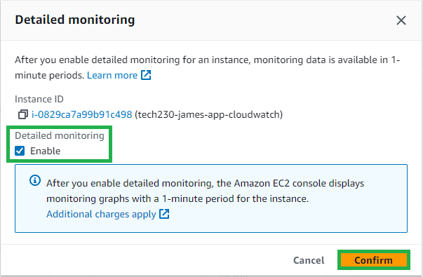

Next, click on `Add to dashboard`.

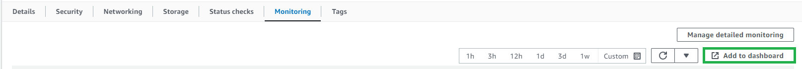

Create a new dashboard by clicking `Create new` then provide a dashboard name and `Create`. Finally, `Add to dashboard`.

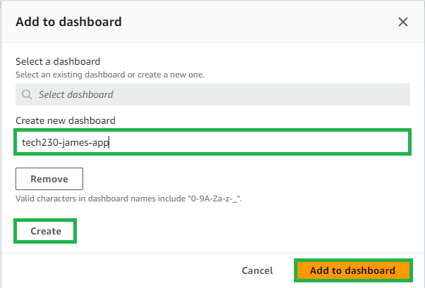

The dashboards are now displayed within AWS CloudWatch.

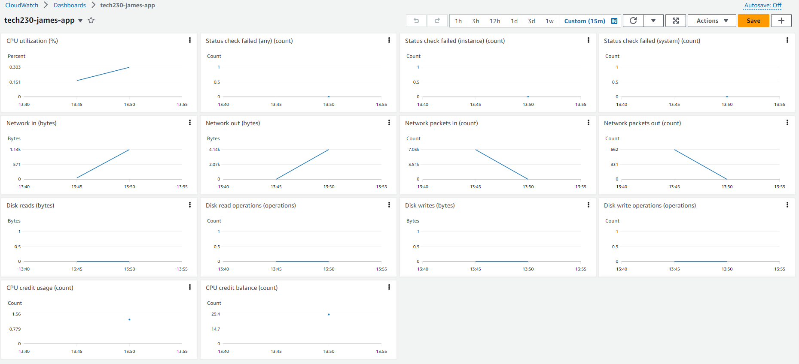

### **Creating a CPU usage alarm for an EC2 instance**

To createa a CPU usage alarm, first naviate to the side panel under `Alarms`, `All alarms` and click `Create alarm`.

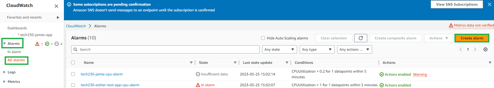

Select the metric (in this case, EC2) and Per-Instance Metrics (in this case, CPU utilization) and  click `Select metric`.

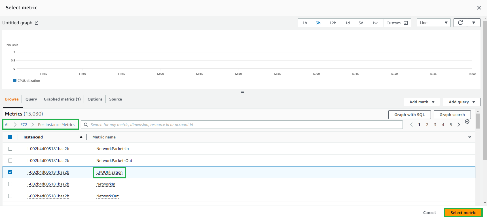

Create a name for the metric and provide the id of the EC2 instance. Within statistics, select `Average` with a period of `1 minute`.

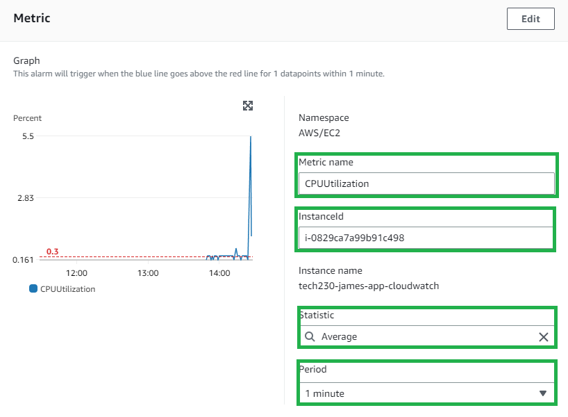

Under `Conditions`, choose a `Static` threshold type and for this example, when the CPU utilization is `Greater/Equal` a value of `0.3`.

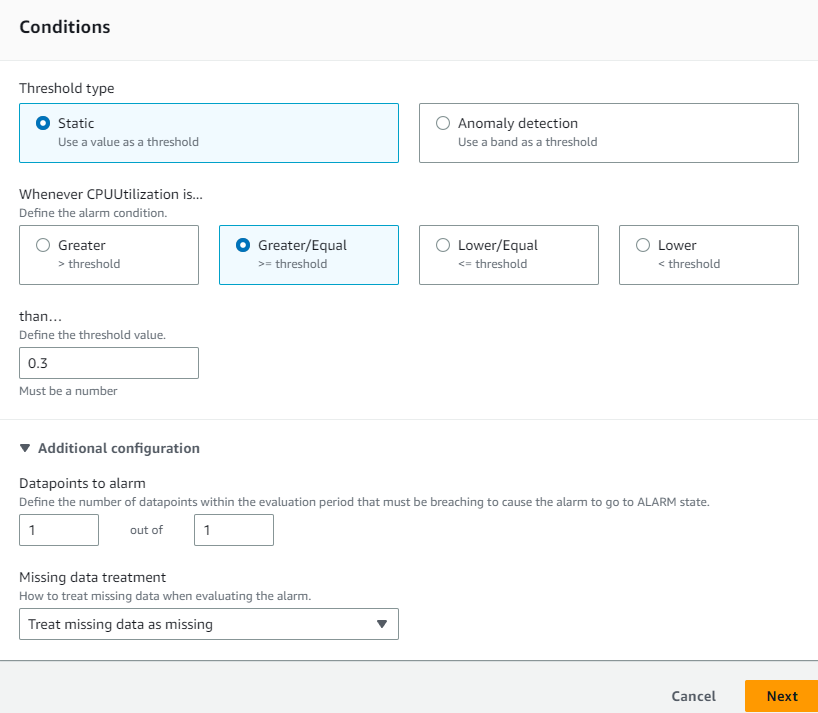

Next in `Notification`, the state trigger is `In alarm` and we would like to send this notification to an email. Therefore, `Create new topic` and provide an email address. Finally `Create topic`.

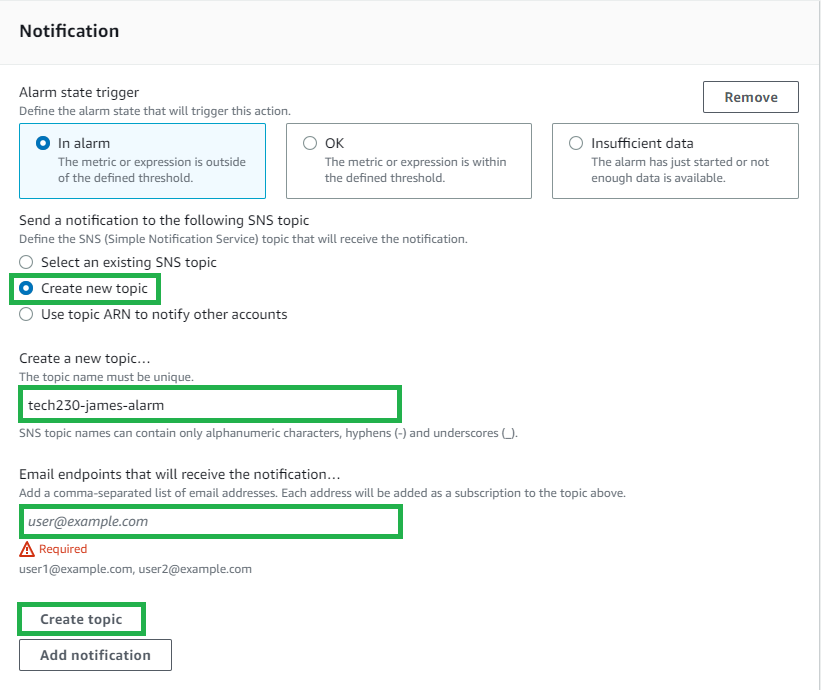

Provide a name and message for when the alarm is triggered.

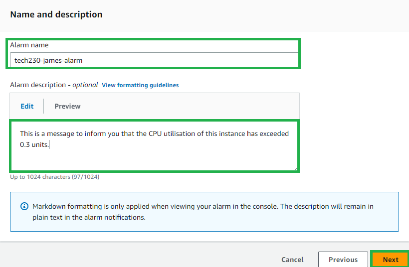

An email should now appear in the users inbox, `Confirm subscription` within the email to subscribe to the alarm.

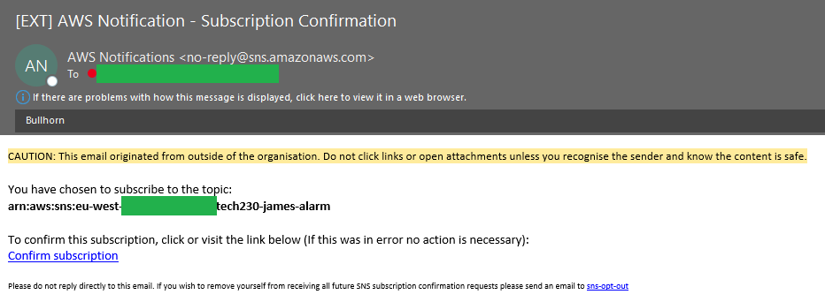

### **Testing the alarm and email notification**

To test the alarm, a suitable CPU load must be performed. In this case, `ssh` into the instance and continuously `update` and `upgrade` the APT packages. 

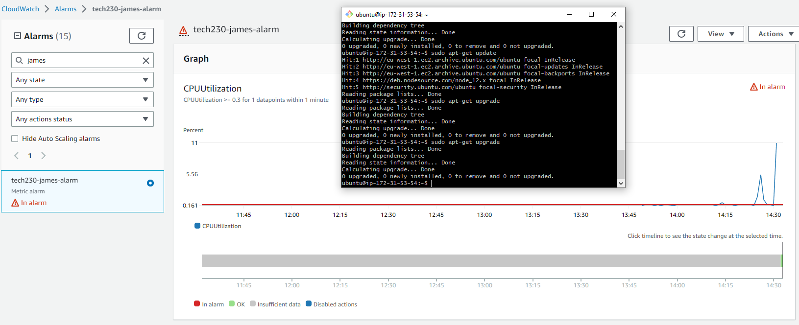

An alarm should now appear within your emails inbox.

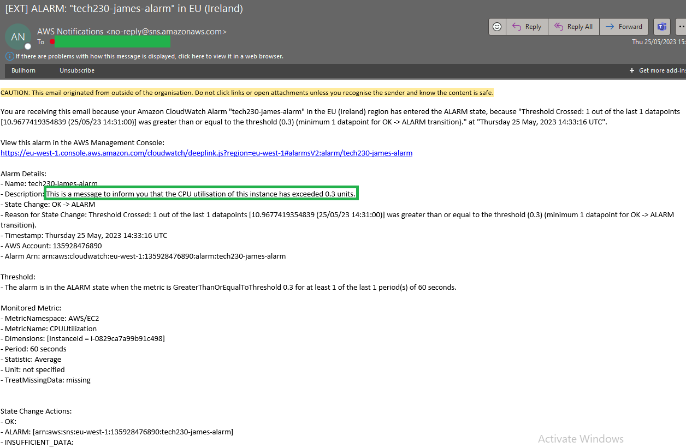