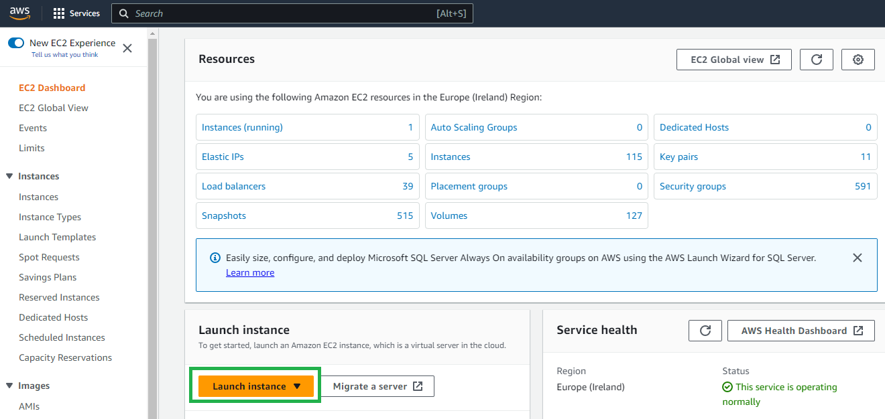
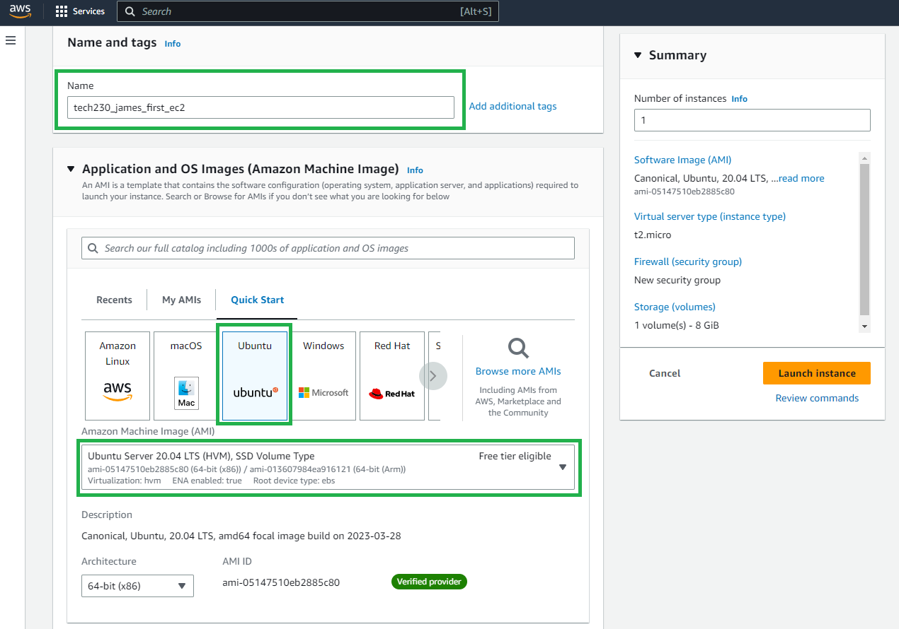
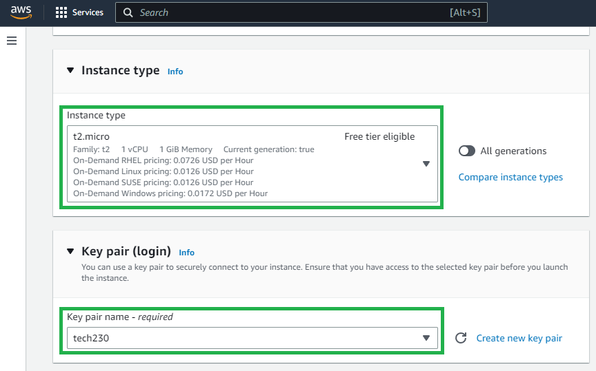
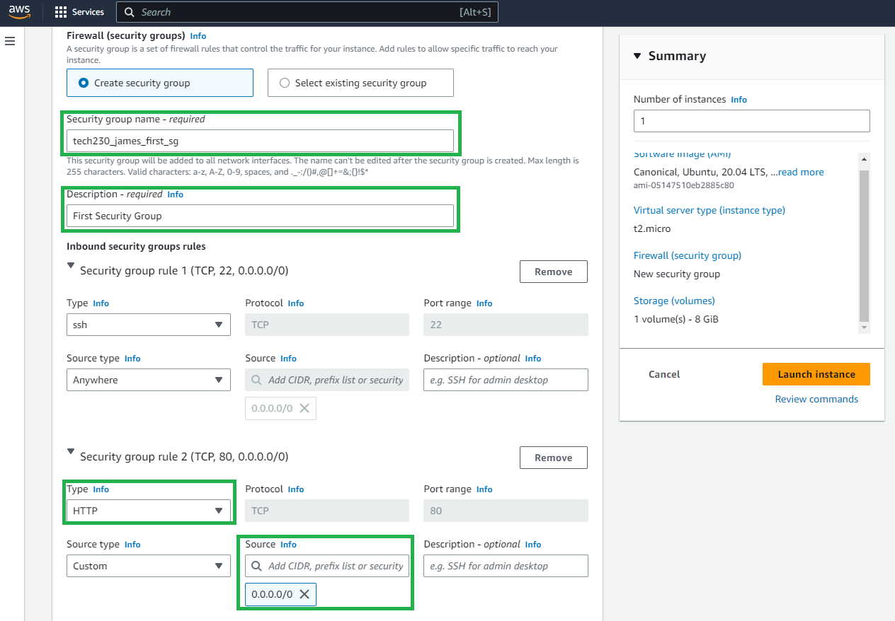
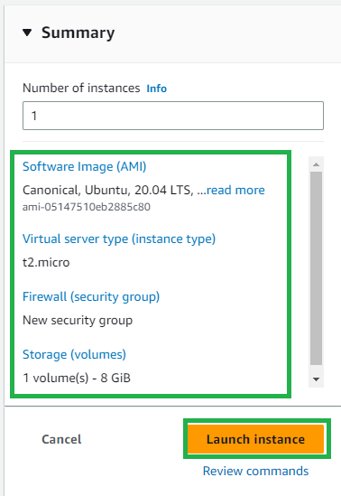
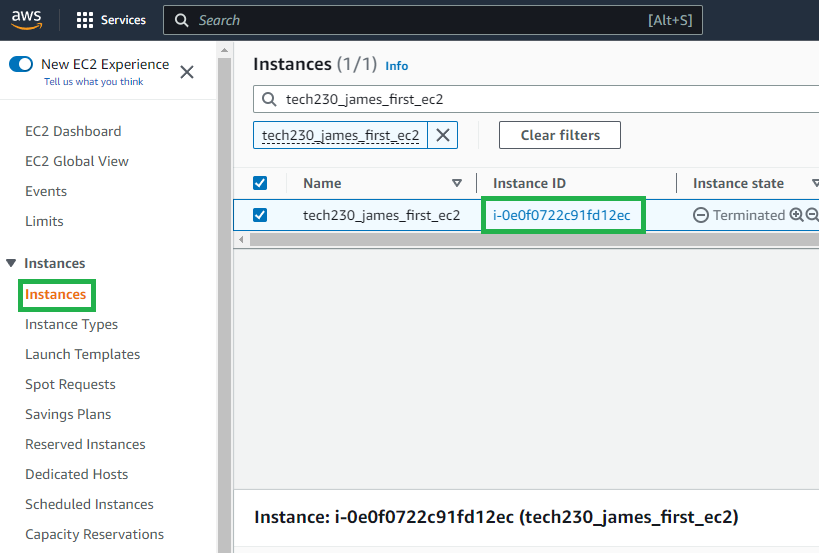
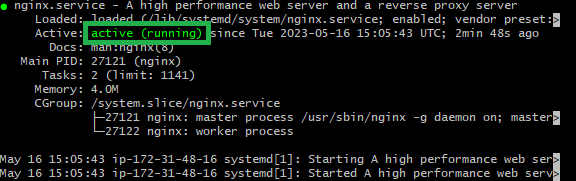

### **Creating an EC2 instance**
1. Login to your AWS account.

2. Navigate to the EC2 service in AWS, this can be done by entering `EC2` in the search bar.

3. Click the "Launch Instance" button.



4. **Naming your instance**; it is recommended that the naming convention is consistent  based on who has created it and its purpose. 

>For example, for my first EC2 instance "tech230_james_first_ec2" (see below).

5. Select the correct operating system, in this case "ubuntu".

6. Ensure the correct machine image is selected, in this case "Ubuntu Server 20.04 (HVM), SSD Volume Type". 



7. Select the instance type for the applications computing requirements.



>Note: For basic applications, `t2.micro` is sufficient. 

8. Configure the firewall to change the security group name and description as shown below. 

>Note: use the same naming convention as shown in `step 4`.

9.  Add a security group rule for inbound; select `HTTP` and the source `0.0.0.0/0`.

>Note: This will allow us to connect to the static webpage further along the tutorial.



10. Finally, check the EC2 has been configured correctly and click the "Launch instance" button.



### **Connecting to the EC2 instance**

1. Locate the `instances` tab within the instances service page.

2. Find the specific instance and click on its `instance id`.



3. Click the "Connect" button.

4. Navigate to the "SSH client" tab and follow the steps.

5. Open a Git bash terminal and change directory into the `.ssh folder`: 

```bash
cd ~/.ssh
```

6. Run this command within the terminal, if necessary, to ensure your key is not publicly viewable. 

```bash
chmod 400 tech230.pem
```

7. Connect with the final ssh command.

>For the example instance, the command would appear as:
```bash
ssh -i "tech230.pem" ubuntu@ec2-54-217-140-141.eu-west-1.compute.amazonaws.com
```

8. Within the EC2 Virtual Machine, ensure all the APT packages are up-to-date.

```bash    
$ sudo apt update -y
$ sudo apt upgrade -y
```

9. Install `nginx` on the Virtual Machine.

```bash
$ sudo apt install nginx
```

>Note: if the VM responds with `E: Unable to fetch some archives, maybe run apt-get update or try with --fix-missing?`; try running `$ sudo apt-get upgrade -y`.

10. Start and enable the nginx web server; run the check status command to ensure it is running.

```bash
$ sudo systemctl start nginx
$ sudo systemctl enable nginx
$ sudo systemctl status nginx
```



11. To access the web server, enter the instances Public IPv4 address into a browsers address bar.


>Note: The web server can be accessed with the `IP address` or with `http://<IP_address>`.