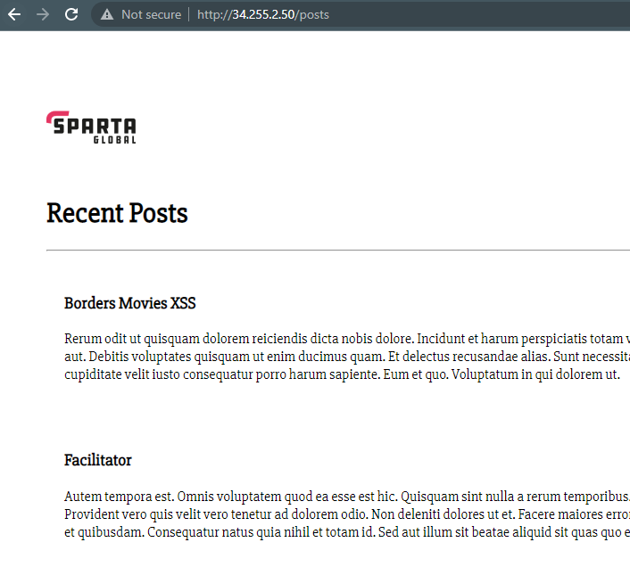

# Deploying an application on an EC2 instance

1. Create an instance through the EC2 service; a detailed guide of this can be found within [Creating an EC2 instance](https://github.com/PutuJem/tech230_AWS/blob/main/creating_an_ec2_instance.md).

2. Create a suitable name for the instance and select the correct operating system and version.

>For the example application, the below was selected.


3. Select an appropriate instance type for the applications computation requirements and ensure the correct key pair selected, as per the screenshot below.


4. For this example, as a security group has already been configured, edit the network settings and select the correct security group from the `select existing security group` tab.

>If a new security group is required, select `create security group` and configure the inbound rules as shown in `step 7`.


5. Check the instance has been configured correctly on the summary page and when ready, launch the instance as shown.


6. Whilst the instance is setting up, check and amend, if required, the `inbound rules` within the `security group`. Firstly, navigate to `security group` and click `Actions` then `edit inbound rules`.


7. Check and amend the configuring as shown to limit the `ssh` connection to the users IP and a new `custom TCP` with port `3000` and `0.0.0.0/0` as an IP. Finally, save the rules.


8. Once the instance has passed all its checks, open a git bash terminal and navigate to the folder containing the application.

9. The contents of the application can now be transferred to the EC2 instance with the `scp` (secure copy) command.

```bash
scp -i "~/.ssh/tech230.pem" -r app ubuntu@ec2-3-249-65-207.eu-west-1.compute.amazonaws.com:/home/ubuntu
```

10. After the transfer is complete, connect to the instance using the `ssh` command shown in the connect section within the instance summary on AWS. 

```bash
ssh -i "tech230.pem" ubuntu@ec2-3-249-65-207.eu-west-1.compute.amazonaws.com
```


11. Confirm the application is now within the instance with the `ls` command.


12. Provision the package manager with the latest packages and nginx installation as per the commands below.

```bash
sudo apt-get update -y
```

```bash
sudo apt-get upgrade -y
```

```bash
sudo apt-get install nginx -y
```

```bash
sudo systemctl start nginx
```

13. Install the applications dependant Node packages as per the commands below.

```bash
sudo apt-get install python-software-properties -y
```

```bash
curl -sL https://deb.nodesource.com/setup_12.x | sudo -E bash -
```

```bash
sudo apt-get install nodejs -y
```

```bash
sudo npm install pm2 -g
```
14. Navigate to the application folder using the `cd` command.

15. Within the application folder, install npm and start the application as per the commands below.

```bash
npm install
```

```bash
pm2 start app.js
```


16. The application should now be available on the web browser with the Public IPv4 address and port number, in this example `3000`. 


### **Deploying a two-tier architecture**

1. Ensure there are first two launch templates for `application` and `MongoDB`; if required, create a `MongoDB` template following this [tutorial](https://github.com/PutuJem/tech230_AWS/blob/main/ec2_mongodb_ami.md).

2. Before launching the instances, review the `security group` used and add an additional inbound rule to allow communication between the two instances. The port to communicate with `MongoDB` is 27017 and allow any IP address to connect (`0.0.0.0/0`).

3. Launch the two instances, for the `application` and `MongoDB`.

4. Firstly, configure the MongoDB instance through initially connecting to the instance with the `ssh` command found in the connect section of the instance summary on AWS.

>The `ssh` command should be displayed as the following; reminder to change directory `cd` into the `.ssh` folder or change the key route to `"~/.ssh/<key_file_name>.pem"`.

```bash
ssh -i "~/.ssh/tech230.pem" ubuntu@ec2-34-244-128-22.eu-west-1.compute.amazonaws.com
```

5. Amend the instances network interfaces to allow the application to connect, do this by accessing the file then changing the `bindIP` to `0.0.0.0/0`.

>Reminder to uncomment the port number, if required.

```bash
sudo nano /etc/mongodb.conf
```

6. Restart and re-enable the database to realise these changes:

```bash
sudo systemctl restart mongod
```

```bash
sudo systemctl enable mongod
```

7. Secondly, configure the application; create a new terminal and ensure the application folder has been transferred on to the application instance; if already complete, skip this step.

>An example of the secure copy command.

```bash
scp -i "~/.ssh/tech230.pem" -r app ubuntu@ec2-34-255-2-50.eu-west-1.compute.amazonaws.com:/home/ubuntu
```

8. Connect to the application instance with the `ssh` command found in the connect section of the instance summary on AWS.

>An example of the ssh command.

```bash
ssh -i "~/.ssh/tech230.pem" ubuntu@ec2-34-255-2-50.eu-west-1.compute.amazonaws.com
```

9. Proceed to adding the environment variable through the `.bashrc` file.

```bash
sudo nano .bashrc
```

10. Add the following export command to the end of the script.

>Add the Private IPv4 address as shown in the application instance summary.

```bash
export DB_HOST=mongodb://<private_IP_address>:27017/posts
```

11. Read and execute the .bashrc file.

```bash
Source .bashrc
```

12. Navigate to the app folder (there may be two app directories to cd into).

```bash
cd app
```

13. Install the package manager `npm`.

>If admin rights are required, try `sudo apt install npm`. Additionally, check if `node seeds/seed/js` has been performed in the terminal, else enter it in as a command.

```bash
npm install
```

14. Run the application.

>If the posts page is not being displayed in the next step, restart the application using `pm2 stop app.js` then running `pm2 start app.js --update-env` to update the environment variables

```bash
pm2 start app.js
```

15. Check to see if the application is running with the posts page by the `public IPv4 address` and `/posts`.

>For example, `34.255.2.50/posts`

