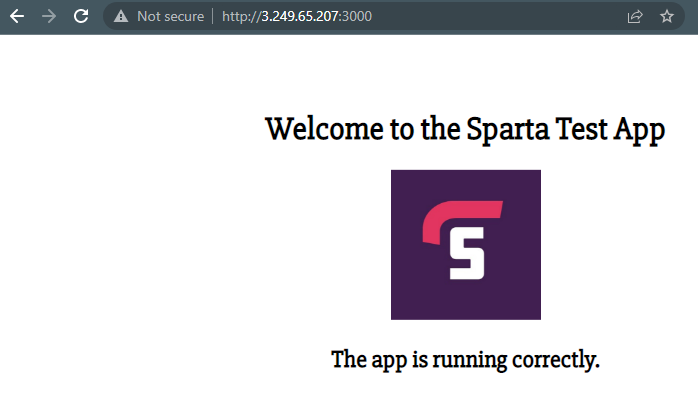

# Deploying an application on an EC2 instance

1. Create an instance through the EC2 service; a detailed guide of this can be found within [Creating an EC2 instance](https://github.com/PutuJem/tech230_AWS/blob/main/creating_an_ec2_instance.md).

2. Create a suitable name for the instance and select the correct operating system and version.

>For the example application, the below was selected.


3. Select an appropriate instance type for the applications computation requirements and ensure the correct key pair selected, as per the screenshot below.


4. For this example, as a security group has already been configured, edit the network settings and select the correct security group from the `select existing security group` tab.

>If a new security group is required, select `create security group` and configure the inbound rules as shown in `step 7`.


5. Check the instance has been configured correctly on the summary page and when ready, launch the instance as shown.


6. Whilst the instance is setting up, check and amend, if required, the `inbound rules` within the `security group`. Firstly, navigate to `security group` and click `Actions` then `edit inbound rules`.


7. Check and amend the configuring as shown to limit the `ssh` connection to the users IP and a new `custom TCP` with port `3000` and `0.0.0.0/0` as an IP. Finally, save the rules.


8. Once the instance has passed all its checks, open a git bash terminal and navigate to the folder containing the application.

9. The contents of the application can now be transferred to the EC2 instance with the `scp` (secure copy) command.

```bash
scp -i "~/.ssh/tech230.pem" -r app ubuntu@ec2-3-249-65-207.eu-west-1.compute.amazonaws.com:/home/ubuntu
```

10. After the transfer is complete, connect to the instance using the `ssh` command shown in the connect section within the instance summary on AWS. 

```bash
ssh -i "tech230.pem" ubuntu@ec2-3-249-65-207.eu-west-1.compute.amazonaws.com
```


11. Confirm the application is now within the instance with the `ls` command.


12. Provision the package manager with the latest packages and nginx installation as per the commands below.

```bash
sudo apt-get update -y
```

```bash
sudo apt-get upgrade -y
```

```bash
sudo apt-get install nginx -y
```

```bash
sudo systemctl start nginx
```

13. Install the applications dependant Node packages as per the commands below.

```bash
sudo apt-get install python-software-properties -y
```

```bash
curl -sL https://deb.nodesource.com/setup_12.x | sudo -E bash -
```

```bash
sudo apt-get install nodejs -y
```

```bash
sudo npm install pm2 -g
```
14. Navigate to the application folder using the `cd` command.

15. Within the application folder, install npm and start the application as per the commands below.

```bash
npm install
```

```bash
pm2 start app.js
```


16. The application should now be available on the web browser with the Public IPv4 address and port number, in this example `3000`. 

