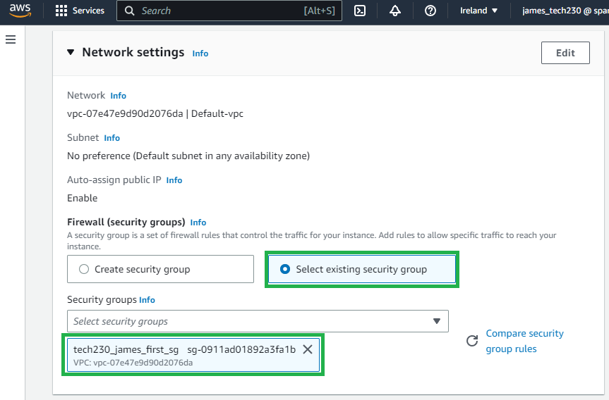

# Creating a MongoDB AMI

### **Creating a MongoDB instance**

1. Create an EC2 instance as instructed within [Creating an EC2 instance](https://github.com/PutuJem/tech230_AWS/blob/main/creating_an_ec2_instance.md).

2. Enter a suitable name, following the recommended convention as per the above guide, and select an appropriate operating system and version for MongoDB to run on.


3. Select a suitable instance type for MongoDB to run and key pair value to enable access the instance.


4. Within the network settings, for this example a security group has already been created which allows `HTTP` inbound access for any IP address (`0.0.0.0/0`).



5. Open the `advance` settings and add a provision within `user data` to install all the necessary packages for the package manager and MongoDB. 


6. Review the summary for the instance configuration and launch the instance when ready.


7. Check the launch was successful and wait until the status checks are complete.


8. Connect to the instance through the `ssh` command, which is shown in the connect section within the instance summary.


### **Creating an AMI from the MongoDB instance**

9. To create the AMI, highlight the MongoDB instance and navigate through `actions`, `image and templates` then select `create template from instance`.


10. Suitably name the template following the instance naming convention and enter an appropriate description. Finally, launch the template.


11. Check the AMI works through creating a new `instance from templates`.


12. Select the AMI image that was recently created.


13. Open a new git bash terminal and connect to the instance through the ssh command again, as shown in `step 8`.

14. Check MongoDB is running with the status command.

```bash
sudo systemctl status mongodb
```

