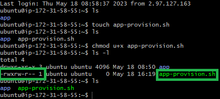

# Automating a reverse proxy and application start-up

Create a new instance of the application image; ensure use the correct naming convention, key pair `tech230.pem` and security group.

Enter the instance through a new git bash terminal using the ssh command provided in the connect section of the instance summary.

>An example of this is shown below.

```bash
ssh -i "~/.ssh/tech230.pem" root@ec2-3-253-80-245.eu-west-1.compute.amazonaws.com
```

Check the files already present with in the instance.

```bash
ls
```

Create a new provision file to include a script to setup the reverse proxy and start the application.

```bash
touch app-provision.sh
```

Check the user rights and ensure the user is able to execute files.

```bash
ls -l
```

```bash
chmod u+x app-provision.sh
```

> Once the file turns green, the user is able to excute.



To setup the automation script, first enter the file.

```bash
sudo nano app-provision.sh
```

Secondly, paste the script below into the `app-provision.sh` file.

> The script provides comments with instructions on what each command accomplishes.

```bash
#!/bin/bash

# Update and upgrade the package manager.

sudo apt-get update -y

sudo apt-get upgrade -y

# Install the Nginx web server.

sudo apt-get install nginx -y

# Overwrite the contents of the default configuration file and output the new file contents.

sudo sed -i 's+try_files $uri $uri/ =404;+proxy_pass http://localhost:3000;+' /etc/nginx/sites-available/default

# change the environment variable

echo 'export DB_HOST=mongodb://<mongodb_private_IP_address>/posts' >> .bashrc

# Start the Nginx web server; remember to use the `enable` to enable a service on next system restart.

sudo systemctl stop nginx

sudo systemctl start nginx

sudo systemctl enable nginx

# install application dependant Node packages

sudo apt-get install python-software-properties -y

curl -sL https://deb.nodesource.com/setup_12.x | sudo -E bash -

sudo apt-get install nodejs -y

sudo npm install pm2 -g

# Get the app folder from a GitHub repo

git clone https://github.com/PutuJem/tech230_AWS.git

# Navigate to the app folder

cd ~/tech230_AWS/app/app/

# Stop all running processes, in case there are any, then run the application

pm2 stop all

npm install

node seeds/seed/js

pm2 start app.js --update-env
```

Save and exit the file using `ctrl+x`.

After starting a new instance, the user will be required to perform a manual command to replace the IP address within the DB_HOST environment variable.

> Amend the `<new_private_IP_address>` as shown in the command below.

```bash
sed -i -e 's/<old_private_IP_address>/<new_private_IP_address>/g' app-provision.sh
```

Navigate to the web browser and enter the public IPv4 address.

# Automating the MongoDB instance and configuration files.

```bash
#!/bin/bash

sudo apt-get update -y

sudo apt-get upgrade -y

sudo apt-key adv --keyserver hkp://keyserver.ubuntu.com:80 --recv D68FA50FEA312927

echo "deb https://repo.mongodb.org/apt/ubuntu xenial/mongodb-org/3.2 multiverse" | sudo tee /etc/apt/sources.list.d/mongodb-org-3.2.list

sudo apt-get update -y

sudo apt-get upgrade -y

sudo apt-get install -y mongodb-org=3.2.20 mongodb-org-server=3.2.20 mongodb-org-shell=3.2.20 mongodb-org-mongos=3.2.20 mongodb-org-tools=3.2.20

sudo systemctl start mongod

sudo systemctl enable mongod

sudo systemctl status mongod


```