# Setting up a Virtual Private Cloud (VPC)

When setting up the VPC, it is first important to understand how each component of the setup work with on another. The diagram below is a visualisation of the connection between these components. 

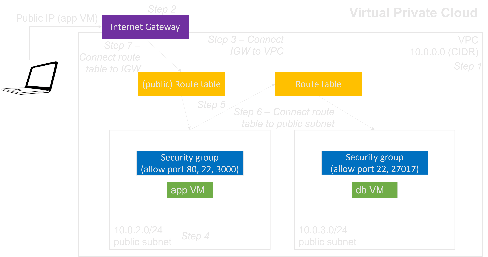

The steps to setup the VPC for this tutorial are outlined below:

- [Step 1: Create a VPC][]
- Step 2: Configure Internet gateway (IGW).
- Step 3: Connect IGW to VPC.
- Step 4: Create Public subnet.
- Step 5: Setup route table.
- Step 6: Connect route table to subnet.
- Step 7: Connect internet gateway to the route table.

### **Step 1: Create a VPC.**

The initial step is to create the VPC through the AWS VPC service and selecting "Create VPC".

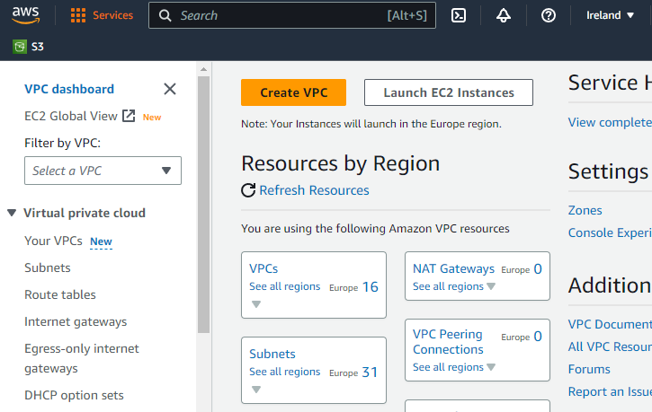

Within the VPC settings, only a VPC is being created with the default CIDR block `10.0.0.0/16` then `create VPC`.

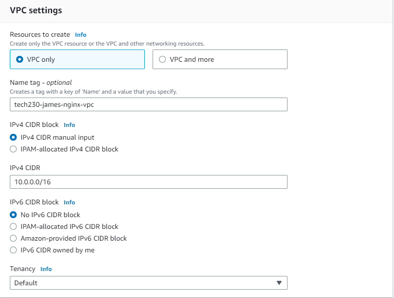

### **Step 2: Configure Internet gateway (IGW).**

Navigate to the `Internet gateways` tab and `Create Internet gateway`. Provde a suitable tag and `Create Internet gateway`.

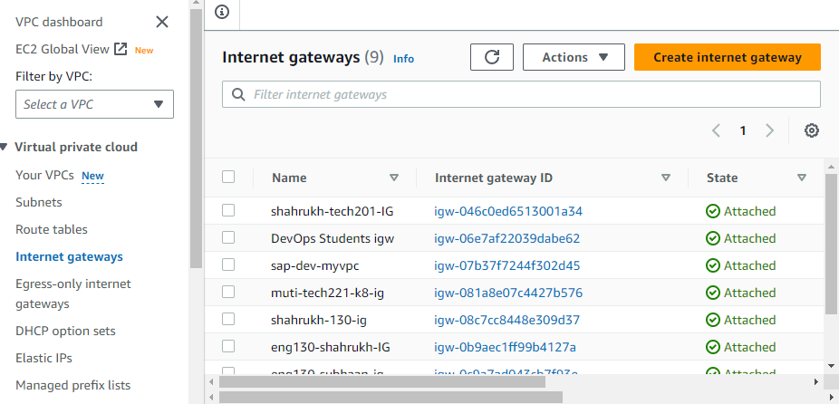

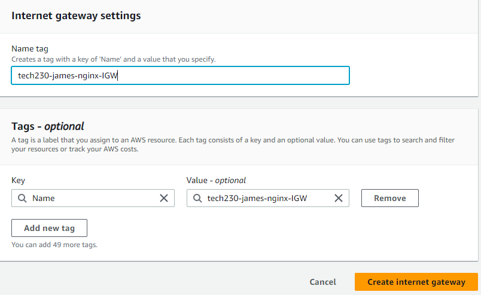

### **Step 3: Connect IGW to VPC.**

A notification should now appear that informs the user to `Attach to a VPC`, select this recommendation and enter the newly created VPC thenm `Attach internet gateway`.

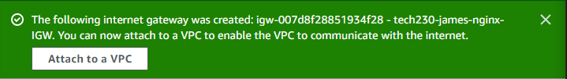

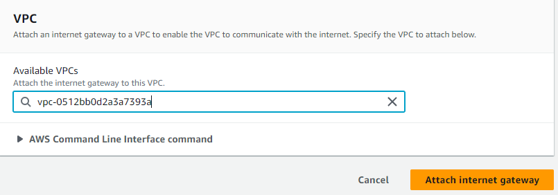

### **Step 4: Create Public subnet.**

Next, `Create subnet` through the `Subnets` tab within the same AWS VPC service.

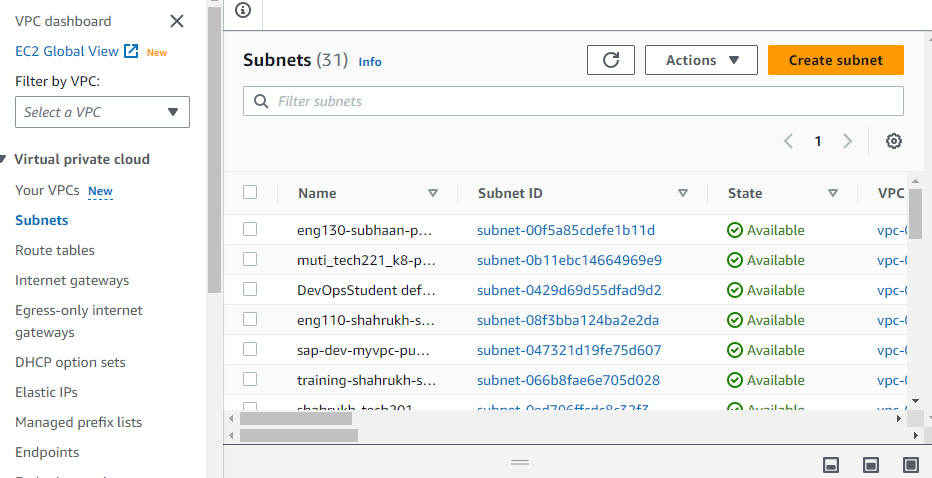

Configure the subnet settings to suite; in this example, the availability zone is assigned to `eu-west-1a` with an IPv4 CIDR block `10.0.2.0/24`. A `Name` key should be automatically created then `Create subnet`.

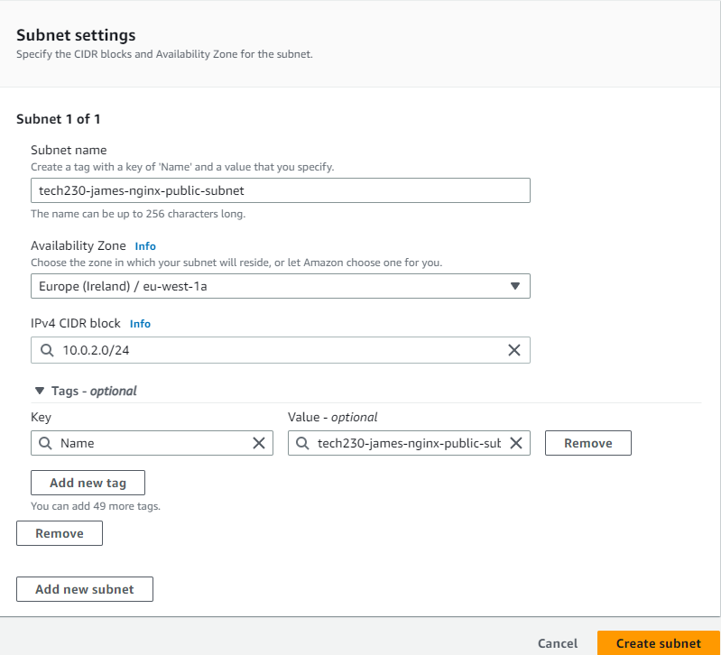

### **Step 5: Setup route table.**

`Create route table` within the `Route tables` tab and allocated a suitable name as well as the recently created VPC.

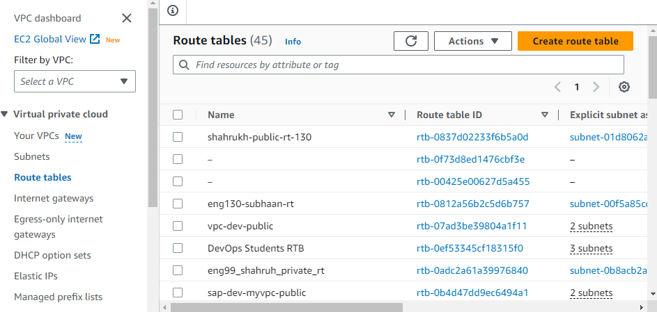

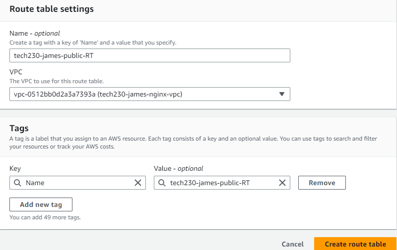

### **Step 6: Connect route table to subnet.**

The route table should now be displayed and after navigating to the `Subnet associations` tab, the new subnet will appear in `Subnets without explicit associations`.

Transfer the VPC to `Explicit subnet associations` through `Edit subnet associations` and highlighting the specific subnet. The subnet should now be displayed within the correct association.

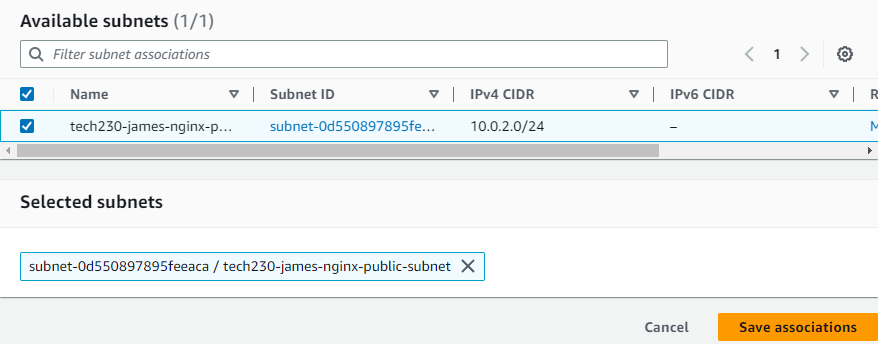

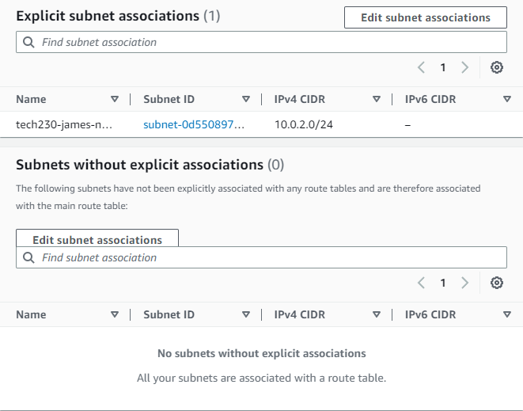

### **Step 7: Connect internet gateway to the route table.**

Staying in the route tables tab, switch to the `Routes` tab and add the connection to the internet gateway by `Edit routes`.

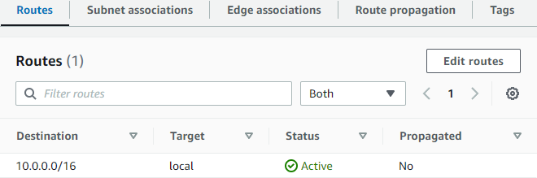

Add a new route with `0.0.0.0/0` as the destination and target as the internet gateway.

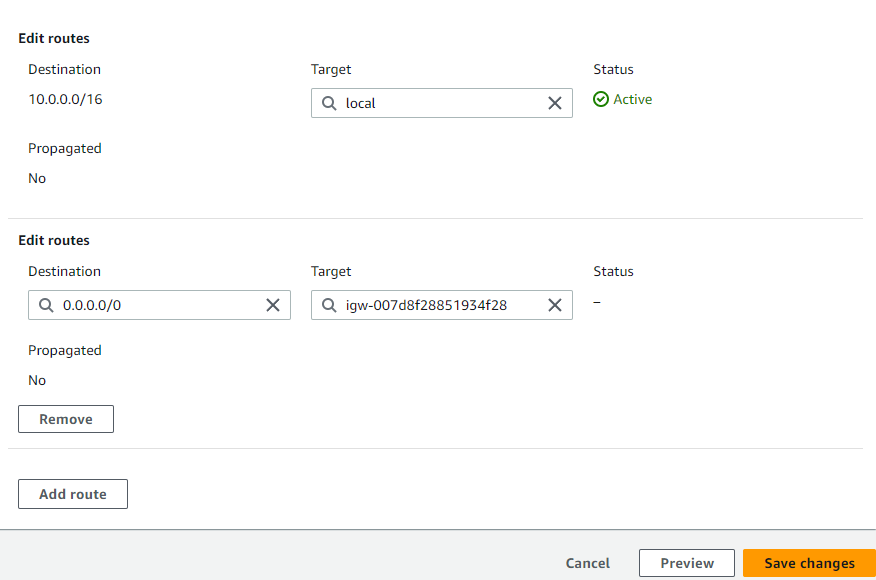

### **Testing the connection to the VPC.**

The VPC has now been setup; this VPC can now be selected when creating an instance within the `network settings`. `Enable` auto-assign public IP and `Create security group`; follow this step if the VPC rules clash with an existing security group. Finally, configure the required protocols and the instance be initialised.

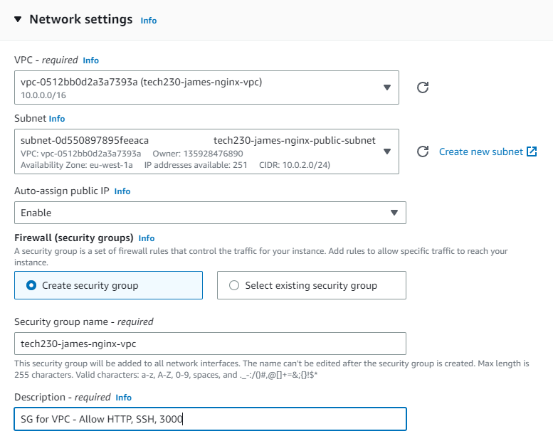

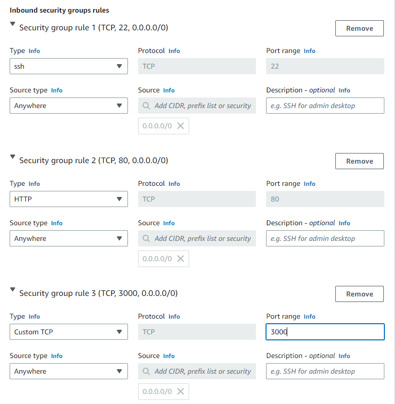

 >In this example, nginx was installed and configured into the new VPC.

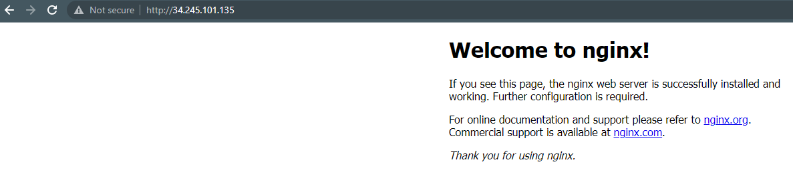

### **Deploying a two-tier architecture on a VPC**

Continuing on from this setup guide, the next stage is to deploy a two tier architecture as shown in the initial VPC diagram.

A prerequisite to beginning this guide is to have an automated userdata script for an application and MongoDB; this script can be found in this [two-tier automation guide](https://github.com/PutuJem/tech230_AWS/blob/main/2-tier-automation.md).

Begin by creating a VPC and Internet Gateway as per Steps 1, 2 and 3.

Then create the public subnet followed by the private subnet in one instance. The public subnet in this example is set to the Availability Zone to `eu-west-1a` and IPv4 CIDR block to `10.0.2.0/24`. The private subnet is alternatively set to the Availability Zone to `eu-west-1b` and IPv4 CIDR block to `10.0.3.0/24`.

Navigate to the route table, which should already have a route table configured; this will be for our private subnet. Create a new route table as per Step 5 and route it to the Internet Gateway. Configure the subnet association to the public subnet. The private subnet will not be required to be modified.

Within the `Your VPCs` tab, your VPC should now display a resource map showing the different connections. Notice the automatic configuration of the private route table and subnet.

Initiate a new instance for the database

Create a new security group only for the database.

Initiate a new instance for the application

Create a new security group only for the application.

Enter the commands to deploy the application and ensure to add the database private IP into the environment variable.

The application should now be available on the web browser.

